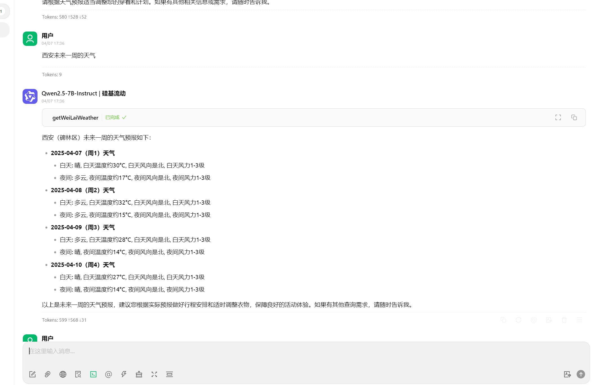
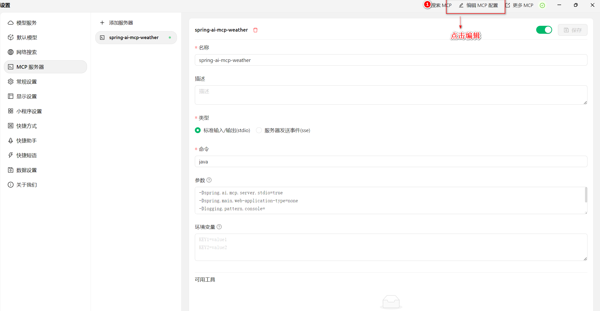
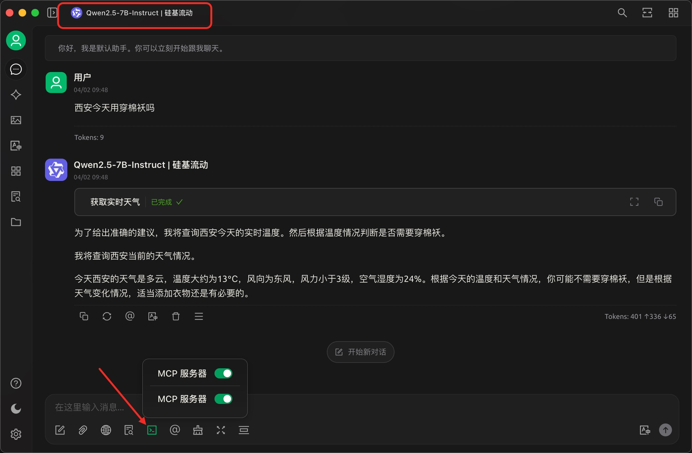

# Simple MCP Server

> 这是一个示例项目,用极简方式演示如何构建MCP Server。

- 天气查询：使用高德开放平台提供的[天气查询API](https://lbs.amap.com/api/webservice/guide/api/weatherinfo)实现MCP Server，可获取实况和未来天气.


## 效果演示



如上图：

- 用户问"西安今天用穿棉袄吗"
- AI自动判断是否要调用天气MCP Server
- AI按照MCP Server的参数要求，将`西安`的经纬度信息提供给MCP Server
- MCP Server内部调用了高德提供的天气查询API，并将结果返回给AI
- AI将天气结果进行汇总整理，输出给用户


## 环境准备

### MCP Server 构建和执行

- Java 17 or later
- Maven 3.6 or later
- Understanding of Spring Boot and Spring AI concepts
- (Optional) Claude Desktop for AI assistant integration

### MCP Client和大模型

> 支持MCP协议的任何AI对话客户端程序都可以，如：Cline、Continue、Claude Desktop等, 本例使用Cherry Studio。

[Cherry Studio](https://cherry-ai.com/)

Cherry Studio是一个AI对话客户端，其支持很多个大模型提供商，如：硅基流动、阿里云百炼、OpenAI等几十个国内外提供商，各提供商分别提供很多大模型服务，各个大模型的能力也有差异，有免费和收费的，也有不同作用和能力的。
当然，Cherry Studio也支持本地运行的大模型，如：Ollama、LLM Studio等。

本文使用硅基流动提供的`Qwen2.5-7B-Instruct`模型，请先注册硅基流动账户，申请API密钥，并在Cherry Studio中配置API密钥。

**注意**：请选择带有`Function Call`功能的大模型(Cherry Studio中带🔧符合的大模型)，如：`Qwen2.5-7B-Instruct`。


### 高德开放平台API密钥

从高德开放平台[申请Web API密钥(key)](https://console.amap.com/dev/key/app)。


## 构建

## Building and Running

The server uses STDIO transport mode and is typically started automatically by the client. To build the server jar:

```bash
./mvnw clean install -DskipTests
```

构建完成后，在项目路径下会产生`target/mcp-weather-stdio-server-0.0.1-SNAPSHOT.jar`文件。


## 安装使用

在 Cherry Studio中打开`设置/MCP服务器`,添加MCP服务器，如下图：




- 名称: 随意写
- 类型：STDIO
- 命令：java
- MCP配置参数（按截图复制粘贴`复制配置参数`）：
  {
  "mcpServers": {
  "spring-ai-mcp-weather": {
  "isActive": true,
  "command": "java",
  "args": [
  "-Dspring.ai.mcp.server.stdio=true",
  "-Dspring.main.web-application-type=none",
  "-Dlogging.pattern.console=",
  "-jar",
  "D:\\xiaob\\starter-stdio-server\\target\\mcp-weather-stdio-server-0.0.1-SNAPSHOT.jar"
  ],
  "name": "spring-ai-mcp-weather",
  "disabledTools": []
  }
  }
  }
## 使用

在Cherry Studio中新建对话，对话框下方开启MCP服务器和刚才安装的MCP Server。

注意：当选择了带有`Function Call`功能的大模型时，下方才有MCP相关选项。


